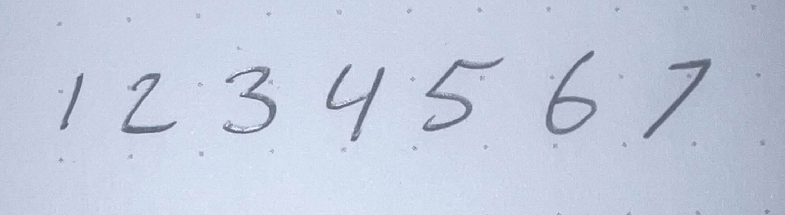
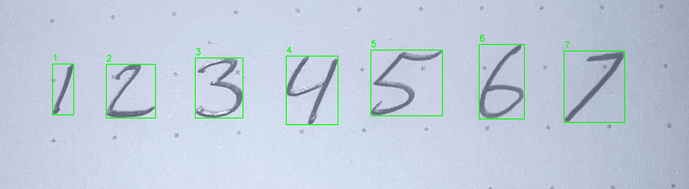

# CNNNumberClassifier Project
## 1. Overview

This project consists of two main components:

1. **Training the MNIST Model**: The training of a digit classification model using the MNIST dataset is detailed in `Train_MNIST_Model.ipynb`.
2. **Digit Detection and Classification**: The main processing script `main.py` utilizes the trained model to detect, extract, and classify digits from an input image.

## 2. Train_MNIST_Model.ipynb

### 2.1 Purpose

The notebook `Train_MNIST_Model.ipynb` trains a convolutional neural network (CNN) to recognize handwritten digits from the MNIST dataset. The model is saved and later used for digit classification in images.

### 2.2 Model Architecture

The model implemented uses a imitation of the TinyVGG architecture, which consists of ten hidden layers within two convolutional blocks followed by a classifier. Here's a detailed breakdown of the architecture:

- **Conv Block 1**:
  - Convolution Layer: Input channels = 1, Output channels = 10, Kernel size = 3x3
  - ReLU Activation
  - Convolution Layer: Input channels = 10, Output channels = 10, Kernel size = 3x3
  - ReLU Activation
  - Max Pooling Layer: Kernel size = 2x2

- **Conv Block 2**:
  - Convolution Layer: Input channels = 10, Output channels = 10, Kernel size = 3x3
  - ReLU Activation
  - Convolution Layer: Input channels = 10, Output channels = 10, Kernel size = 3x3
  - ReLU Activation
  - Max Pooling Layer: Kernel size = 2x2

- **Classifier**:
  - Flatten Layer
  - Fully Connected Layer: Input features = 490, Output features = 10 (corresponding to the digits 0-9)

### 2.3 Training Process

- **Data Loading**: The MNIST dataset is loaded and normalized.
- **Training**: The model is trained using a loss function (CrossEntropyLoss) and an optimizer (Stochastic gradient descent).
- **Validation**: The accuracy of the model is checked on the validation set to ensure it learns correctly.
- **Saving the Model**: The trained model's state dictionary is saved to a file for later use.

## 3. main.py

### 3.1 Purpose

The `main.py` script uses the trained model to detect, extract, and classify digits from an input image. It processes the image, identifies contours that may represent digits, resizes these regions to match the model's input size, and uses the model to predict the digit class.

### 3.2 How the Code Works

1. **Loading the Model**: The script loads the trained MNIST model using the `load_model` function.

2. **Preprocessing the Image**:
   - Reads an input image containing only numbers and converts it to grayscale.
   - Applies Gaussian blur and adaptive thresholding to enhance the digit regions.
   - Uses erosion and dilation to clean up noise in the image.

3. **Component Analysis**:
   - Identifies connected components in the thresholded image.
   - Filters components based on a minimum area to remove noise and small artifacts.

4. **Contour Detection**:
   - Finds contours around potential digit regions.
   - Filters contours based on area and aspect ratio to identify likely digits.

5. **Resizing Digits**:
   - Extracts the region within each bounding box and resizes it to a 28x28 image, matching the input size expected by the model.

6. **Classification**:
   - Converts the resized images to tensors and passes them through the model to predict the digit class.
   - Annotates the original image with bounding boxes and the predicted digits.

7. **Saving the Results**:
   - The annotated image is saved as `result.png`, and predictions are printed.

### 3.3 Example Output

The input image, `sample_image.jpg`, contains handwritten digits that the script processes and classifies. The output, `result.png`, shows the original image with the detected digits marked and labeled with their predicted values.

*Sample input image containing handwritten digits.*

Command line output `Predictions: ['1', '2', '3', '4', '5', '6', '7']`
*Output image showing detected digits with predictions.*
